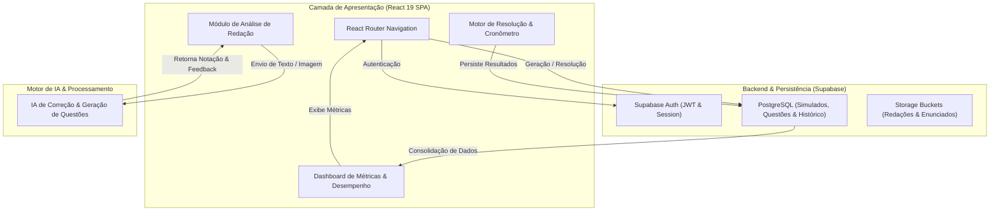

<div align="center">
  # INTELFLUX CONCURSOS
  
  **Plataforma Inteligente de Geração de Simulados, Questões e Correção de Redação com Inteligência Artificial**

  [](https://react.dev/)
  [](https://www.typescriptlang.org/)
  [](https://supabase.com/)
  [](https://vitejs.dev/)
  [](https://modo-caverna-red.vercel.app)

</div>

---

## Visão Geral do Sistema

O **Intelflux Concursos** (também conhecido como *Modo Caverna*) é uma plataforma EdTech de alta performance projetada para otimizar a preparação de estudantes para concursos públicos. O sistema integra geração inteligente de simulados personalizados, resolução cronometrada de questões com feedback instantâneo e um módulo avançado de avaliação e correção de redações guiado por IA.

A arquitetura foi estruturada para entregar:
1. **Geração Dinâmica de Simulados**: Criação instantânea de provas personalizadas por disciplina, banca examinadora, nível de dificuldade e número de questões.
2. **Ambiente de Prova Imersivo (Modo Caverna)**: Interface de resolução focada em produtividade, com cronômetro integrado, marcação de dúvidas e navegação fluida.
3. **Avaliação Detalhada & Analytics**: Diagnóstico imediato de desempenho com análise de taxa de acerto por matéria, tempo médio por questão e histórico de evolução.
4. **Módulo de Correção de Redação por IA**: Análise estrutural de textos com critérios oficiais de bancas (Cespe/Cebraspe, FGV, FCC), oferecendo nota detalhada e sugestões de reescrita.

---

## Diagrama de Arquitetura do Sistema



---

## Principais Funcionalidades

- **Gerador de Simulados por IA**: Criação de provas sob medida com seleção de matérias, bancas e quantidade de questões.
- **Interface de Resolução (Modo Caverna)**: Ambiente de simulado sem distrações, controle de tempo regressivo e cartão resposta interativo.
- **Correção Inteligente de Redação**: Análise automática de redações com feedback pedagógico, pontuação por competências e pontos de melhoria.
- **Análise de Desempenho & Estatísticas**: Gráficos e relatórios visuais com divisão por disciplina, acertos, erros e tempo gasto.
- **Histórico & Revisão de Gabarito**: Acesso completo a provas anteriores com comentários e explicações detalhadas por questão.
- **Autenticação & Perfis**: Gestão segura de usuários e persistência em nuvem via Supabase.

---

## Tecnologias & Engenharia de Stack

### **Frontend**
- **React 19.2**: Utilização das APIs mais recentes do React para componentes reativos e performáticos.
- **TypeScript 6.0 (Strict Mode)**: Tipagem estática rigorosa para garantia de integridade dos contratos de dados.
- **Vite 8.1**: Build tool de última geração com bundling ultrarrápido e Hot Module Replacement.
- **Lucide React**: Biblioteca de iconografia moderna.
- **React Router Dom 7.18**: Roteamento declarativo no lado do cliente.

### **Backend & Infraestrutura**
- **Supabase PostgreSQL**: Banco de dados relacional para persistência de dados de usuários, simulados e estatísticas.
- **Supabase Auth**: Sistema completo de gestão de identidade e sessões de usuário.
- **Vercel**: Hospedagem global e integração contínua (CI/CD).

---

## Estrutura do Projeto

```text
intelflux-concursos/
├── src/
│   ├── components/       # Componentes de interface reutilizáveis
│   ├── contexts/         # Contextos globais (Autenticação, Estado de Prova)
│   ├── data/             # Mocks, bancos de dados locais e fixtures de questões
│   ├── hooks/            # Custom Hooks para gerenciamento de estado e APIs
│   ├── lib/              # Inicialização do cliente Supabase e utilitários
│   ├── pages/            # Páginas e rotas principais da aplicação
│   │   ├── DashboardPage.tsx  # Visão geral e atalhos rápidos
│   │   ├── GeneratePage.tsx   # Configuração e geração de simulado
│   │   ├── HistoryPage.tsx    # Histórico de simulados e redações
│   │   ├── LoginPage.tsx      # Login e cadastro de estudantes
│   │   ├── RedacaoPage.tsx    # Envio e correção de redação por IA
│   │   ├── ResultsPage.tsx    # Resultado detalhado do simulado
│   │   ├── SolvePage.tsx      # Tela de execução da prova com cronômetro
│   │   └── StatsPage.tsx      # Relatórios estatísticos de evolução
│   └── types/            # Definições de interfaces e tipos TypeScript
├── public/               # Ativos estáticos e favicon
├── index.html            # Ponto de entrada HTML
├── vite.config.ts        # Configuração do Vite
└── package.json          # Manifesto de dependências e scripts npm
```

---

## Instalação e Execução Local

### **Pré-requisitos**
- **Node.js**: `v18.0.0` ou superior
- **npm**: `v9.0.0` ou superior

### **Passos para Instalação**

1. **Acessar o diretório do projeto:**
   ```bash
   cd intelflux-concursos
   ```

2. **Instalar dependências:**
   ```bash
   npm install
   ```

3. **Configuração de Variáveis de Ambiente:**
   Crie o arquivo `.env` com suas chaves do Supabase:
   ```env
   VITE_SUPABASE_URL=sua_url_do_supabase
   VITE_SUPABASE_ANON_KEY=sua_chave_anonima_do_supabase
   ```

4. **Executar Servidor de Desenvolvimento:**
   ```bash
   npm run dev
   ```
   Acesse no navegador: `http://localhost:5173` ou veja em produção em `https://modo-caverna-red.vercel.app`.

5. **Gerar Build de Produção:**
   ```bash
   npm run build
   ```

---

<div align="center">
  <p>Desenvolvido por <strong>Alan Silva</strong> | Soluções em IA & Desenvolvimento</p>
</div>
